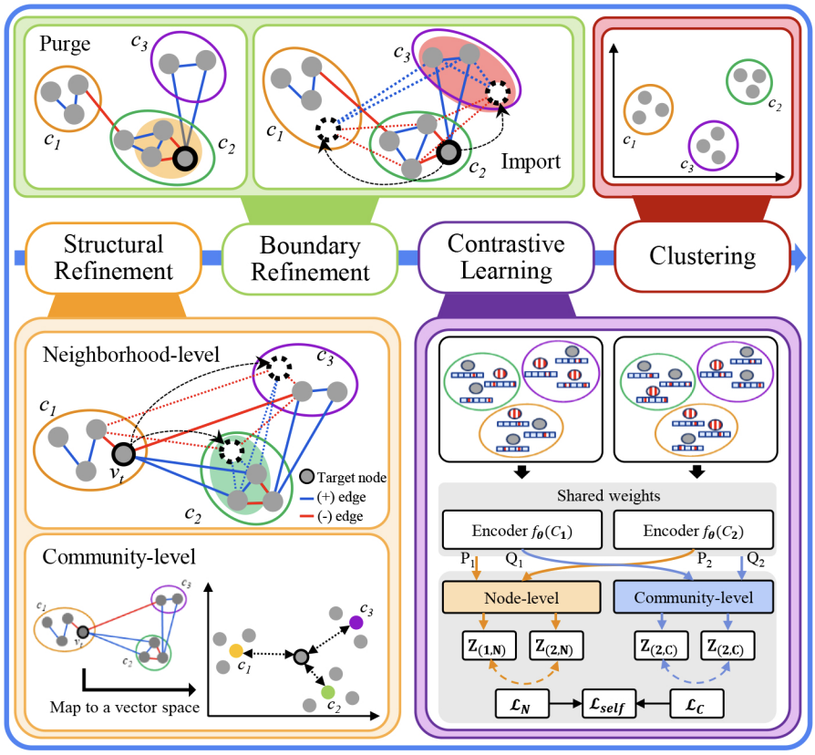

<div align="center">

# ReCon: Improving the Accuracy of Community Detection on Signed Networks via Community Refinement and Contrastive Learning

Hojin Kim<sup>*, 1</sup> · Hyunuk Shin<sup>*, 1</sup> · Chanyoung Lee<sup>*, 1</sup> · Yeon-Chang Lee<sup>2</sup> · David Yoon Suk Kang<sup>†, 1</sup>

<sup>1</sup> Chungbuk National University · <sup>2</sup> Ulsan National Institute of Science and Technology

<p align="center">
  
</p>


</div>


## Setup
We ran the experiments in the following environment:
```
- ubuntu: 24.04
- python: 3.10
- cuda: 12.5
- pytorch: 2.5.1
- GPU: RTX 3090
```

## Installation
```bash
uv sync
uv pip install torch-scatter torch-sparse -f https://data.pyg.org/whl/torch-2.5.1+cu124.html
```
For our implementation, we based our code on [SPONGE](https://github.com/alan-turing-institute/SigNet) and [SSSNET](https://github.com/SherylHYX/SSSNET_Signed_Clustering). Specifically, SPONGE and SSSNET are utilized for the initial clustering within our framework.


## Usage

### GUI Application (Recommended)
Launch the interactive web interface:
```bash
uv run streamlit run app.py
```

Or use the helper scripts:
```bash
./run_gui.sh
./run_gui_conda.sh
```

The GUI provides:
- 🎯 Interactive parameter configuration (K, initial method, iterations, device, seed)
- 🔧 Advanced refinement/re-clustering settings (alpha/beta/neg weight, method)
- 📁 Data input via upload (.pt/.pk) or built-in examples
- 📊 Real-time progress and metric comparison (initial vs final)
- 🎬 Animated refinement process (purge/import/refine) with timeline
- 📈 Cluster size evolution and Sankey flow analysis
- 💾 Result export (clusters + metrics CSV)

Supported data formats:
- **.pt**: PyTorch tensors via `torch.load`
- **.pk**: pickle via `pickle.load`

Expected data dictionary keys:
- `A_p`: Positive adjacency matrix
- `A_n`: Negative adjacency matrix
- `feat_L` (optional): Node features
- `labels` or `y` (optional): Ground truth labels

### Command Line Interface
```bash
uv run python main.py --data-path data/SSBM/N1000_K5_p0.01_eta0.02.pt --initial-method SPONGE --K 5
```

## Citation
```
@article{shin2025recon,
  title={ReCon: Improving the Accuracy of Community Detection on Signed Networks via Community Refinement and Contrastive Learning},
  author={Hojin Kim, Hyunuk Shin, Chanyoung Lee, Yeon-Chang Lee, and David Yoon Suk Kang},
  journal={arXiv preprint arXiv:XXXX.XXXXX},
  year={2026}
}
```
