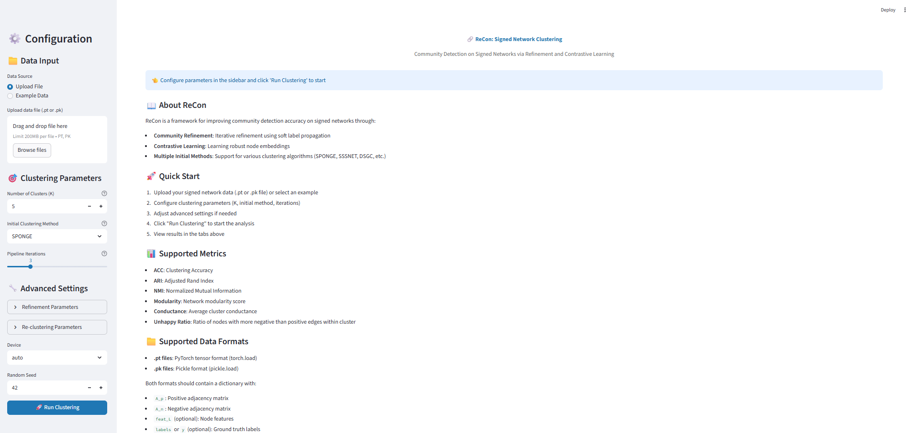
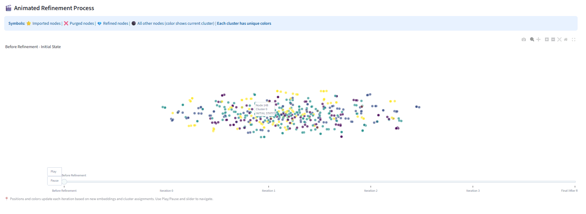

<div align="center">

# OpenReCon: A GUI-Driven Post-ProcessingSoftware for Improving the Accuracy of SignedCommunity Detection

Hojin Kim<sup> 1</sup> · Bogoan Kim<sup> </sup> · David Yoon Suk Kang<sup>†

<sup></sup> Chungbuk National University · 

<p align="center">
  
  
</p>


</div>


For reproduction on NVIDIA Blackwell GPUs, we additionally tested the code in the following environment:

- OS: Ubuntu 24.04
- Python: 3.10
- PyTorch: 2.11.0
- PyTorch CUDA runtime: 12.8
- NVIDIA driver: 580.173.02
- GPU: NVIDIA GeForce RTX 5090

## Installation
```bash
uv sync
uv pip install torch-scatter torch-sparse -f https://data.pyg.org/whl/torch-2.5.1+cu124.html
```
For our implementation, we based our code on [SPONGE](https://github.com/alan-turing-institute/SigNet) and [SSSNET](https://github.com/SherylHYX/SSSNET_Signed_Clustering). Specifically, SPONGE and SSSNET are utilized for the initial clustering within our framework.


## Usage

### GUI Application (Recommended)
Launch the interactive web interface:
```bash
uv run streamlit run app.py
```

Or use the helper scripts:
```bash
./run_gui.sh
./run_gui_conda.sh
```

The GUI provides:
- 🎯 Interactive parameter configuration (K, initial method, iterations, device, seed)
- 🔧 Advanced refinement/re-clustering settings (alpha/beta/neg weight, method)
- 📁 Data input via upload (.pt/.pk) or built-in examples
- 📊 Real-time progress and metric comparison (initial vs final)
- 🎬 Animated refinement process (purge/import/refine) with timeline
- 📈 Cluster size evolution and Sankey flow analysis
- 💾 Result export (clusters + metrics CSV)

Supported data formats:
- **.pt**: PyTorch tensors via `torch.load`
- **.pk**: pickle via `pickle.load`

Expected data dictionary keys:
- `A_p`: Positive adjacency matrix
- `A_n`: Negative adjacency matrix
- `feat_L` (optional): Node features
- `labels` or `y` (optional): Ground truth labels

### Command Line Interface
```bash
./run_gui.sh
```

## Code Metadata
| Nr. | Code metadata description | Metadata |
| --- | --- | --- |
| C1 | Current code version | 0.1.0 |
| C2 | Permanent link to code/repository used for this code version | (GitHub release or commit permalink to be filled) |
| C3 | Permanent link to Reproducible Capsule | (Zenodo DOI or capsule link to be filled) |
| C4 | Legal Code License | MIT License || C5 | Code versioning system used | Git |
| C6 | Software code languages, tools, and services used | Python 3.10, Streamlit, PyTorch 2.11.0, PyTorch Geometric, torch-scatter, scikit-learn, SciPy, NumPy, Pandas, NetworkX, Plotly |
| C7 | Compilation requirements, operating environments & dependencies | Ubuntu 24.04; NVIDIA GPU recommended; NVIDIA RTX 5090 tested; NVIDIA driver 580.173.02; PyTorch built with CUDA 12.8 or later and support for compute capability `sm_120` required |
| C8 | If available, link to developer documentation/manual | README.md |
| C9 | Support email for questions | khojin.01@cbnu.ac.kr |